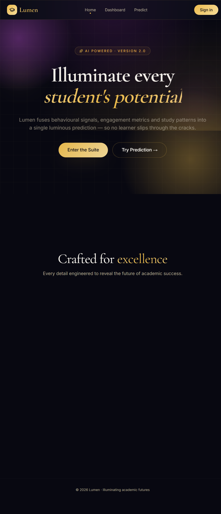
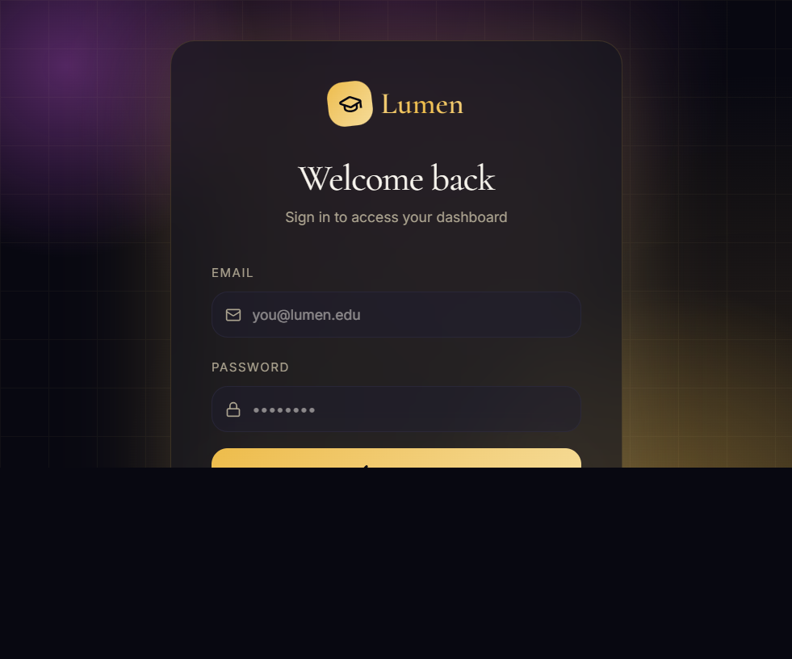
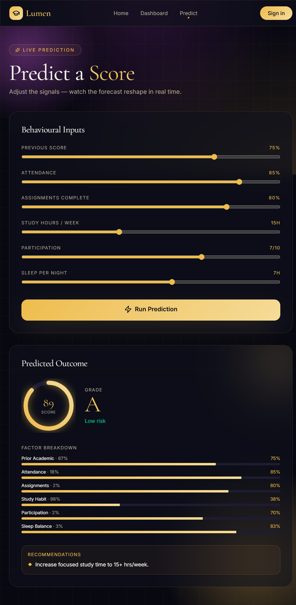

# Lumen Performance Predictor

## Overview

Lumen Performance Predictor is a polished web application designed to help educators and academic coaches predict student success based on engagement and behavioural signals. The app combines a lightweight prediction model with an elegant, dashboard-style UI for tracking student performance, identifying at-risk learners, and examining the factors that matter most.

This repository is built with:
- **React 19**
- **Vite**
- **@tanstack/react-router**
- **Tailwind CSS**
- **Framer Motion**
- **Radix UI**

---

## What Lumen Does

Lumen helps you:
- Add students and track key academic signals
- Generate a performance forecast using a weighted behavioural model
- See predicted grade, risk category, and factor breakdowns
- Explore student progress with clean charts, cards, and responsive controls
- Maintain a private, local-first experience using browser storage

---

## Key Features

- **Student Dashboard**
  - Live list of learners with summary cards
  - Search and filter by student name or email
  - Add and remove student records
  - At-a-glance cohort metrics: total students, average predicted score, top performers, and at-risk learners

- **Prediction Suite**
  - Live student-score predictions based on attendance, study habits, assignments, participation, and sleep
  - Factor breakdown bars show the contribution of each input
  - Personalized suggestions to improve performance

- **Authentication Flow**
  - Simple sign-in / sign-up experience
  - Protected dashboard access
  - Persistent session state via local storage

- **Modern UI**
  - Glassmorphism cards with motion and blur effects
  - Responsive layout for desktop and mobile
  - Elegant call-to-action buttons and information hierarchy

---

## Pages

### Home
- Presents the Lumen concept and product highlights
- Offers quick access to login and prediction tools
- Displays brand metrics and feature summary cards

### Login / Signup
- Single entry point for authentication
- Demo-friendly form with validation
- Redirects to dashboard after successful login

### Dashboard
- Student management and cohort analytics
- Predictive card view for individual learners
- Risk and success metrics with color-coded status bars
- Student input sliders and inline trend indicators

### Predict
- Live prediction lab with adjustable sliders
- Real-time score, grade, and risk assessment
- Factor breakdown and recommendations panel

---

## Prediction Model

The app uses a weighted scoring model in `src/lib/students-store.ts`:
- Prior academic score: 30%
- Attendance: 18%
- Assignment completion: 18%
- Study hours: 14%
- Participation: 12%
- Sleep quality: 8%

The model maps the resulting score to:
- `A+`, `A`, `B`, `C`, `D`, `F`
- Risk categories: `Low`, `Medium`, `High`

This makes the predictor both interpretable and easy to extend.

---

## Installation

```bash
npm install
```

### Local development

```bash
npm run dev
```

Open the app at the local address shown by Vite.

### Production build

```bash
npm run build
npm run preview
```

---

## Project Structure

- `src/routes/` — application pages and route components
- `src/components/` — shared UI components and layout pieces
- `src/lib/` — student model, predictions, and storage logic
- `public/` — static assets
- `package.json` — dependencies and scripts

---

## Screenshots

> Add interface screenshots to the `screenshots/` folder and update these image paths if needed.

### Home page



### Login / Signup flow



### Student Dashboard


### Live Prediction tool



---

## How to Use

1. Run the app locally with `npm run dev`.
2. Open the browser and navigate to the local app URL.
3. Use the **Sign in** button to log in or create a demo account.
4. Go to the **Dashboard** to view seeded students and add new learners.
5. Visit **Predict** to experiment with inputs and see how the prediction changes.

---

## Notes

- The app stores student records and authentication state in the browser's local storage.
- The current demo supports adding students and running predictions entirely on the client.
- You can customize the scoring logic in `src/lib/students-store.ts`.

---

## Future Improvements

- Add real authentication and user accounts
- Persist data to a backend database
- Add charts and trend history for each student
- Support cohort segmentation and export reports
- Enhance the prediction engine with machine learning models

---
---

## Deployment

This project runs an SSR Node server and requires a MongoDB instance for the API. Below are quick deployment options.

Prerequisites:
- Set `MONGODB_URI` and (optional) `MONGODB_DB` environment variables on the host.

1) Docker (recommended for self-hosting)

Build image locally:

```bash
docker build -t lumen-performance-predictor:latest .
```

Run container (example):

```bash
docker run -e MONGODB_URI="your-mongo-uri" -p 3000:3000 lumen-performance-predictor:latest
```

2) Vercel

- Add this repository to Vercel and deploy from the `main` branch.
- Vercel should automatically detect the project, but you can enforce npm with `vercel.json`.
- Set the Environment Variables `MONGODB_URI` and `MONGODB_DB` in the Vercel project dashboard.
- Recommended build settings:
  - Install Command: `npm install`
  - Build Command: `npm run build`
  - Output Directory: leave blank or `.output/public` if asked.
- Make sure Vercel uses Node 20+ by setting the `package.json` `engines.node` field and including `.nvmrc`.

3) Render (one-click friendly)

- Create a new Web Service on Render.
- Set the repo, build command: `npm install && npm run build` and start command: `npm run start`.
- Add environment variables `MONGODB_URI` and `MONGODB_DB` in the Render dashboard.
- You can also include the provided `render.yaml` manifest for infra-as-code deployments.

4) Railway / Fly / Heroku

- Similar approach: configure the repo, set `MONGODB_URI`, use build command `npm install && npm run build`, and start command `npm run start` or `npm run preview`.

Notes:
- The app expects a Node-capable host (server-side runtime). It is not suitable for static-only hosts unless you remove the API & Mongo usage.
- The repository includes a `Dockerfile`, `.dockerignore`, `Procfile`, and `render.yaml` to assist deployment.

If you want, I can generate a `docker-compose.yml` for local development or create provider-specific step-by-step instructions.

### Docker Compose (local development)

A `docker-compose.yml` is included to run a local MongoDB and the app together for development.

Bring the stack up (uses the included `.env.compose`):

```bash
docker compose up --build
```

Run in detached mode:

```bash
docker compose up --build -d
```

Stop and remove containers:

```bash
docker compose down
```

The `.env.compose` file exposes `MONGODB_URI=mongodb://mongo:27017` and `MONGODB_DB=lumen`. Modify it if you want to point to a different Mongo instance.

## License

This repository is a demo project and may be used for learning or prototyping.
